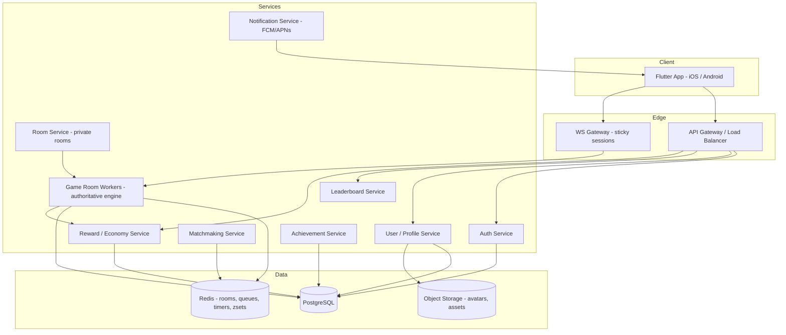

# Ludo Game App — Phase 1: Complete Technical Plan

Below is the full architecture proposal. Nothing is coded yet — this is the blueprint for your approval. All branding, art, and UI will be original; nothing is derived from existing Ludo titles.

---

## 1. Recommended Tech Stack & Why

| Layer | Technology | Why |
|---|---|---|
| Mobile client | **Flutter (Dart)** | One codebase → Android + iOS, 60 FPS via Skia/Impeller rendering, excellent animation support, strong responsive-layout system for phones/tablets. Ideal for board games (no heavy 3D needed). |
| Client rendering | Flutter widgets + `Rive`/`Lottie` for micro-animations, `flame` optional for effects | Board can be pure widgets (crisp, scalable) with animation layers on top. |
| Client state | **Riverpod** | Testable, compile-safe, separates game engine from UI cleanly. |
| Backend framework | **NestJS (TypeScript)** on Node.js | Modular services (auth, matchmaking, rooms, economy…), strong typing, mature ecosystem, good for scaling with game-room workers. |
| Real-time transport | **Colyseus-style authoritative game rooms over WebSocket** (or NestJS + `socket.io` gateway with Redis adapter) | Room-based model maps 1:1 to Ludo matches; horizontal scaling via Redis pub/sub. |
| Primary database | **PostgreSQL** | ACID for users, matches, transactions, achievements. |
| Cache / realtime layer | **Redis** | Room registry, matchmaking queue, turn timers, leaderboards (sorted sets), idempotency/rate-limit keys. |
| Auth | **Firebase Auth** (Google/Apple/Email) or custom OAuth2 + JWT | Firebase = fastest MVP; provider-agnostic adapter layer so it's swappable later. |
| Dice RNG | Server-side crypto-secure RNG (`crypto.randomInt`) | Tamper-proof, auditable. |
| Audio | Original/royalty-free SFX via `audioplayers`, music via `just_audio` | Independent music/sound toggles. |
| Admin panel | **React + NestJS admin module** (or NestJS AdminJS for MVP) | Reuses backend; protected APIs. |
| Deployment | Docker → Kubernetes or managed (Cloud Run/Fly.io) | Room workers scale independently. |
| Monitoring | Sentry (crash reporting) + Prometheus/Grafana + structured logs | Required for thousands of concurrent players. |

**Why not Unity?** A Ludo game is UI/2D-centric; Unity adds build size and complexity without benefit here. Flutter gives native-feeling screens (login, profile, leaderboard) and a fully custom board for free.

---

## 2. System Architecture



Key principles:

- **Server-authoritative**: dice, moves, captures, rewards are computed only on the server. The client renders what the server says.
- **Room worker isolation**: each match runs in a lightweight authoritative room process. Rooms are ephemeral; Redis tracks which node owns which room so reconnects route correctly.
- **Deterministic event stream**: the server never sends a full board every tick. It sends ordered *events* (dice rolled, token moved 3 → 7, capture at 14, turn passed); the client animates events and can rebuild state from a snapshot + event log after reconnect.

---

## 3. Frontend Architecture (Flutter)

Layered, game-logic separated from UI:

| Layer | Responsibility | Notes |
|---|---|---|
| **Presentation** | Screens, widgets, animations | No rules logic. Renders state; emits user intents. |
| **State management** | Riverpod providers | Holds `MatchState`, connection status, user profile. |
| **Game engine (client)** | Pure Dart: path math, valid-move computation (from server hints), animation stepping | Mirror of server logic — never authoritative online; drives offline/local/AI modes directly. |
| **Networking** | WebSocket client + REST client, auto-reconnect, event replay | Optimistic UI only for dice-tap animation, never for results. |
| **Local storage** | Hive/`shared_prefs` — settings, guest profile, daily-reward streak | Never stores authoritative coins/gems online. |
| **Audio/Animation services** | Sound manager, animation controllers | Independently togglable. |

Important design decision: the **same Dart engine runs offline games (local, pass-and-play, AI) fully on-device**, and **online games become a thin renderer of server events**. The engine package has zero Flutter imports so it's unit-testable in pure Dart.

---

## 4. Backend Architecture (NestJS micro-modular)

| Service | Scope | Scale strategy |
|---|---|---|
| Auth | Login (Google/Apple/Email/Guest), JWT issuance, refresh, device binding | Stateless, horizontal |
| User | Profile, XP/level, avatars, match history | Stateless + Postgres |
| Matchmaking | Random-match queues by mode/2–3–4P/region | Redis sorted queues; scales with sharded queue workers |
| Game Room | Authoritative Ludo engine, turn timers, reconnect windows, event log | One room = one lightweight actor; autoscaled node pool; Redis room registry |
| Room (private) | Create/join by code, lobby, ready state | Redis-first, persisted on match start |
| Leaderboard | Global/weekly/monthly/friends | Redis sorted sets + Postgres rollup job |
| Economy | Coins/gems ledger, daily rewards, win rewards — **ledger-based, server-validated** | Double-entry style transactions table |
| Achievements | Progress tracking, unlock grants | Event-driven from match completion |
| Notification | FCM/APNs push, in-app inbox | Queue-backed (BullMQ) |
| Admin | Users, bans, economy config, rules config, AI difficulty, events | Role-protected (RBAC) |

**Rules-as-config**: all rule toggles (extra turn on six/capture/home, three-sixes penalty, exact-roll-to-finish, turn timers, entry roll) live in a versioned `ruleset` JSON schema stored in DB, referenced per match. The engine is written against the ruleset — changing config never requires engine rewrites. AI difficulty parameters are also config-driven.

---

## 5. Database Schema (PostgreSQL)

```sql
users (
  id UUID PK, username TEXT UNIQUE, email TEXT NULL, auth_provider TEXT,
  avatar_url TEXT, level INT, xp INT, coins BIGINT, gems BIGINT,
  wins INT, losses INT, favorite_color TEXT,
  is_banned BOOL, created_at TIMESTAMPTZ
)

matches (
  id UUID PK, mode TEXT, player_count INT, ruleset JSONB,
  status TEXT,             -- pending | active | completed | abandoned | timeout
  winner_id UUID NULL, created_at, completed_at
)

match_players (
  match_id UUID FK, user_id UUID, seat INT, color TEXT, tokens_home INT, result TEXT
)

game_states (                     -- persisted snapshot for reconnect & audit
  match_id UUID FK, seq INT, snapshot JSONB, event_log JSONB,
  turn INT, dice INT, timer_expires_at, updated_at,
  PRIMARY KEY (match_id, seq)
)

transactions (                    -- every coin/gem change, immutable ledger
  id UUID PK, user_id UUID, currency TEXT,  -- coins | gems
  amount INT, reason TEXT, ref_id UUID, created_at
)

achievements (
  id UUID PK, code TEXT UNIQUE, name TEXT, target INT, reward_currency, reward_amount
)
user_achievements (
  user_id UUID, achievement_id UUID, progress INT, unlocked_at TIMESTAMPTZ NULL,
  PRIMARY KEY (user_id, achievement_id)
)

daily_rewards (
  user_id UUID, streak INT, last_claimed_at DATE, PRIMARY KEY (user_id)
)

friendships ( user_id, friend_id, status, created_at )
notifications ( id, user_id, type, payload JSONB, read BOOL, created_at )
rulesets ( id, version INT, config JSONB, is_default BOOL )
```

Redis: `room:{id}` registry, `queue:mm:{mode}` matchmaking zsets, `timer:turn:{matchId}`, `leaderboard:global|weekly|monthly`, `ratelimit:{userId}:{action}`, `idem:{requestId}`.

---

## 6. Multiplayer Architecture

- **Connection**: WS with sticky sessions; auth token on connect; heartbeat every 10s.
- **Room lifecycle**: `lobby → active → finished/abandoned`. Max idle before start, turn timer enforced server-side.
- **Turn flow (authoritative)**:
  1. Server decides current player, starts turn timer.
  2. Player taps dice → `roll_dice` request (idempotency key).
  3. Server validates it's their turn, rate-limits, generates dice via crypto RNG, computes valid moves, broadcasts `dice_rolled` + `moves_available`.
  4. Player sends `select_move(tokenId)`. Server validates against its own valid-move list (never trusts client coordinates), applies move, captures, extra-turn rules, broadcasts ordered events.
  5. Timeout → server auto-plays a valid move (configurable) and advances turn.
- **Reconnect**: player token binds to seat. On reconnect, server sends latest snapshot + missed events. 60s grace window before seat is AI-substituted or match is forfeited.
- **Duplicate/invalid requests**: idempotency keys + server-side expected-sequence check; out-of-order actions are rejected, not replayed.
- **Scaling**: room workers are stateless actors registered in Redis; load balancer routes by room ownership. 10k concurrent rooms ≈ a few modest nodes; matchmaking is queue-based and shardable.

---

## 7. Game-State Architecture

Single source of truth (server), mirrored on clients:

```json
{
  "matchId": "uuid",
  "ruleset": { "entryRoll": 6, "extraTurnOnSix": true, "extraTurnOnCapture": true,
               "extraTurnOnHome": true, "threeSixesPenalty": "lose_turn",
               "exactRollToFinish": true, "turnSeconds": 15 },
  "players": [ { "seat": 0, "userId": "uuid", "color": "red",
                 "tokens": [ { "id": 0, "pos": 51 } ],   // -1 = base, 0–51 = path, 52–56 = home column
                 "state": "connected" } ],
  "turn": { "seat": 0, "dice": null, "moves": [], "deadline": 1695810000000 },
  "status": "active",
  "winner": null,
  "seq": 42,
  "serverTime": 1695809985000
}
```

- **Board model**: 52 shared cells + 6 home-column cells per player + base + finish. Safe cells (starred) defined in a board layout constant shared by client and server.
- **Event model**: `dice_rolled`, `move_selected`, `step_moved`, `token_captured`, `token_finished`, `extra_turn`, `turn_skipped`, `match_ended`, `player_left`, `reconnect`. Clients animate events in order — never teleport.
- Client engine (Dart) shares the **same layout + ruleset JSON**, enabling offline modes and client-side "which tokens are highlighted" (server also sends validated `moves[]` for defense in depth).

---

## 8. Complete Screen List

| # | Screen | Key elements |
|---|---|---|
| 1 | Splash | Original logo, animated dice, loader → Home |
| 2 | Onboarding (3 pages) | Play with Friends / Play Online / Challenge AI + Skip |
| 3 | Login / Guest | Guest, Google, Apple, Email |
| 4 | Home | Avatar, name, level, coins, gems, notifications, prominent Play, all mode entries |
| 5 | Game Mode Select | 2/3/4P cards, Classic/Quick, Private, AI, Local |
| 6 | Local Setup | Player count, names, colors, rules toggles |
| 7 | AI Setup | Difficulty: Easy/Medium/Hard, player count |
| 8 | Matchmaking | Search animation, player cards, match-found burst, cancel, connection state |
| 9 | Private Room Lobby | Room code, copy/share, waiting players with avatars + ready status, rule selector |
| 10 | Join Room | Code entry |
| 11 | **Game Board** | Top: opponents; center: board; bottom: avatar, dice, turn/timer, token status; winner overlay |
| 12 | Match Result | Ranking, rewards animation, XP, rematch/home |
| 13 | Profile | Stats, achievements, match history |
| 14 | Leaderboard | Tabs: Global/Weekly/Monthly/Friends |
| 15 | Daily Reward | 7-day calendar, claim animation |
| 16 | Achievements | Grid with progress bars |
| 17 | Notifications | Inbox |
| 18 | Settings | Sound/Music/Vibration/Language/Privacy/Account/Logout/Help/About |
| 19 | Friends | List, invite, online status |
| 20 | Match History | Past matches with results |
| 21 | Admin Dashboard (web) | Users, matches, bans, economy, rules, AI config, stats |
| 22 | Error/Reconnect overlays | Generic friendly messages, retry paths |

---

## 9. Folder Structure

```
ludo/
├── apps/
│   ├── mobile/                     # Flutter app
│   │   ├── lib/
│   │   │   ├── main.dart
│   │   │   ├── core/               # theme, di, utils, router, constants
│   │   │   ├── data/               # api clients, ws client, local storage, DTOs
│   │   │   ├── domain/             # use-cases: start_match, roll_dice, claim_reward
│   │   │   ├── engine/             # PURE DART ludo engine (no Flutter imports)
│   │   │   │   ├── board.dart / path.dart / rules.dart
│   │   │   │   ├── move_validator.dart / capture.dart / finish.dart
│   │   │   │   ├── ai/             # easy.dart medium.dart hard.dart, scoring.dart
│   │   │   │   └── engine_test/    # pure-Dart unit tests
│   │   │   ├── features/           # UI feature-first
│   │   │   │   ├── splash/ onboarding/ auth/ home/ mode_select/
│   │   │   │   ├── matchmaking/ private_room/ game/  # game: board, dice, token widgets
│   │   │   │   ├── profile/ leaderboard/ rewards/ achievements/
│   │   │   │   ├── settings/ friends/ notifications/ history/
│   │   │   │   └── shared/          # reusable widgets: buttons, cards, avatars, dialogs
│   │   │   └── services/           # audio, animation, connectivity, analytics
│   │   └── assets/                 # images, animations (Rive/Lottie), sfx, i18n
│   ├── backend/                    # NestJS
│   │   └── src/
│   │       ├── auth/ user/ matchmaking/ room/ game/   # game/: authoritative engine port + room actor
│   │       ├── leaderboard/ economy/ achievements/ notification/